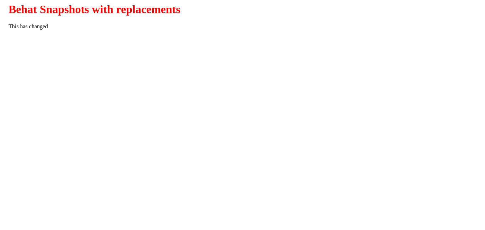
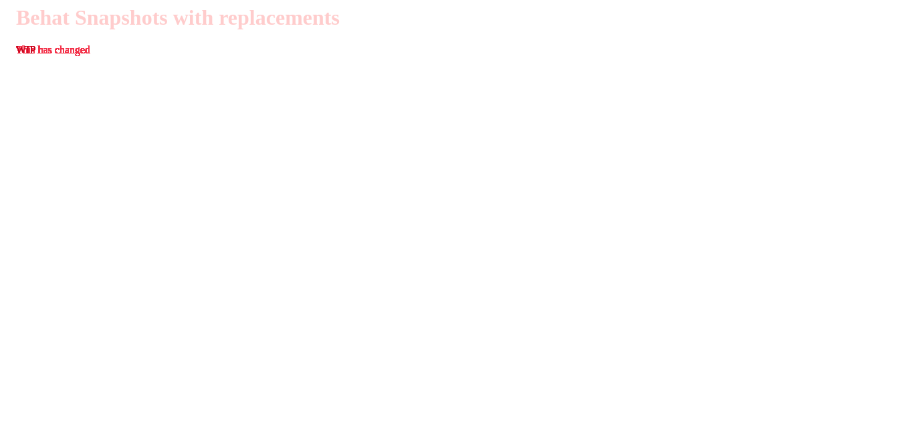

# Behat Snapshots Plugin

This plugin adds custom Behat steps to test against visual and HTML regressions.

Visual and HTML regressions are specially hard to detect with automated testing, because things like style changes can have unintended consequences that don't break functionality but cause small graphical glitches. And accesibility changes in the HTML can also go unnoticed. The way snapshot testing works is that snapshot files are created during development, and committed alongside the source code in the repository. Then, in CI environments and during further development, new snapshots are generated and compared against the previous ones. If anything has changed unintentionally, it will thus be detected and reported.

## Configuration and usage

In order to use the custom steps, you need to include this plugin in your Moodle installation. This is only necessary for testing and development environments; make sure not to include it in production.

You'll also need to add the following attributes in your `config.php`:

```php
// Configure where snapshot files will be created and read from.
$CFG->behat_snapshots_path = '/var/www/html/local/behatsnapshots/snapshots';

// (optional) Threshold to consider image differences a regression.
// This value will be used for comparing UI snapshots, and is only relevant
// when the imagick PHP extension is installed. Images are compared using the
// Root Mean Squared metric.
//
// Default value: 0.005.
$CFG->behat_snapshots_image_threshold = 0.01;
```

### Comparing snapshots

In order to compare snapshots, you'll need to use one of the following steps in your tests:

```Gherkin
# Compare the HTML of the current page with the stored snapshot.
Then the HTML should match the snapshot

# Compare the UI of the current page with the stored snapshot.
# This step only works in tests using the @javascript tag.
Then the UI should match the snapshot
```

### Managing snapshots

The first time you run the tests, they will fail because the snapshots don't exist yet. You can add the `@creates_snapshots` tag and it will create snapshots instead of running any comparisons.

Later on, it is possible that you introduce some changes in the code that are intentional and don't cause a regression. In this case, you can either delete the existing snapshots and use `@creates_snapshots` again, or use the `@overrides_snapshots` tag which will override the snapshots, without checking for their existence or running any comparisons.

It is important that you commit the snapshot files generated using this process in the repository, so that other developers and CI environments rely on these validated snapshots, rather than generating new ones every time.

Also, make sure that you are not including these tags in the repository, and only use them to generate the snapshots locally. The `@overrides_snapshots` tag is specially dangerous, because it won't run any comparisons an can render these tests useless.

### Comparing HTML

Ideally, HTML snapshots comparisons would only fail when there are relevant differences for users. For example, changing the order of attributes in elements or having more or less whitespace is irrelevant when HTML is rendered in the DOM.

Alternatively, it's also possible that sometimes parts of the HTML are expected to change. For example, if some part is showing the current date or a user id that is generated randomly in tests.

However, with the current implementation, HTML comparison is mostly string based. In order to improve that, there are a couple of configuration options that can be tweaked to improve this.

#### Regular expressions

If some parts are expected to change, they can be replaced with regular expressions which will be used when comparing the lines. Regexes should be encapsulated within `[[]]`, check out the following example for reference:

```html
<div>
    <h1>Welcome</h1>
    <p>Hello [[[\w\s]+]], today is [[(Monday|Tuesday|Wednesday|Thursday|Friday|Saturday|Sunday)]].</p>
</div>
```

With the snapshot above, the following html would match:

```html
<div>
    <h1>Welcome</h1>
    <p>Hello John Doe, today is Monday.</p>
</div>
```

#### Replacements

If some parts are known to be problematic but are not relevant to the HTML output, the can be replaced using the `behat_snapshots_replacements` configuration.

For example, given the following configuration:

```php
$CFG->behat_snapshots_replacements = [
    '/ style=".*"/' => '',
];
```

The following two HTML snapshots would be considered equal, because the style attributes would be removed:

```html
<div class="foo bar" style="display: block;">
    Hi there!
</div>
```

```html
<div style="display: block;" class="foo bar">
    Hi there!
</div>
```

### Comparing UI

In some ocassions, there may be parts of the UI that are variable. Those should be minimised by setting predictable values with generators, but if that's not possible the following helpers may be useful. You will normally call these before taking a UI snapshot.

#### Replacements

You can replace text in the UI using the following step:

```Gherkin
When I replace "/.*/" within "h1" with "Replacement text"
```

The first argument will be the string to search for, or a regular expression to match against if it's padded within `/`. The second argument will be a CSS selector to specify where the replacement will happen. And the last argument will be the text to replace matches with.

#### Styles

If you need to change CSS, you can set inline styles using the following step:

```Gherkin
When I set "h1" styles to "background" "red"
```

The first argument is the CSS selector to find the element or elements affected, the second is the name of the property to set, and the third is the value. The example above would result in the following styles:

```html
<h1 style="background: red">
    Title
</h1>
```

### Testing the Moodle App

This plugin comes with built-in support to test Moodle App UI, so it should work out of the box.

However, keep in mind that given the nature of the app and its heavy reliance on JavaScript, HTML tests may be more flaky than ideal. You should be able to improve these using the techniques described in [Comparing HTML](#comparing-html).

### Disable snapshots

If you want to disable running snapshot comparisons in the current environment, you can set the `MOODLE_BEHATSNAPSHOTS_DISABLED` env variable or the `$CFG->behat_snapshots_disabled` config to `true`.

## Examples

If you want to see some examples of how to use this plugin and what the snapshots look like, this plugin uses itself in its tests:

- You can find some tests in the [snapshots.feature](tests/behat/snapshots.feature) file.
- You can find some snapshots in the [snapshots](snapshots) folder.
- The plugin is configured in CI using Github Actions, you can find the configuration in [moodle-ci.yml](.github/workflows/moodle-ci.yml).

### HTML diff

This is how an HTML diff looks:

```diff
#1 (line 3)
<     <p>WIP</p>
---
>     <p>This has changed</p>
```

### UI diff

This is how a UI diff looks:

#### Original


#### Changed



#### Diff


